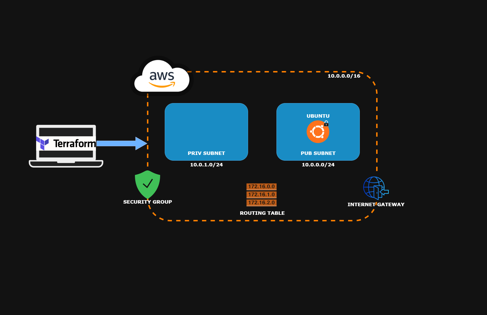

# Project Overview



This is a beginner-friendly Terraform setup to create and provision AWS infrastructure. It demonstrates infrastructure as code (IaC) principles by defining:

- A custom VPC with private and public subnets
- Internet access configuration (IGW + route tables)
- A security group with SSH access
- Key pair management with Terraform
- A Ubuntu EC2 instance hosted in the public subnet

This lab was created as part of my DevOps learning journey to understand networking, IAM, and basic cloud provisioning using Terraform and AWS.

---

## Usage

### Prerequisites
- AWS CLI configured with IAM user
- Terraform installed
- Git

### Steps (via CLI)
```bash
git clone https://github.com/criptic87/terraform.git
cd terraform
terraform init
terraform plan
terraform apply
```

To restrict SSH access to your IP (recommended):
```bash
terraform apply -var="allowed_ssh_cidr=YOUR_IP/32"
```

### Outputs
- `instance_public_ip`
- `key_pair_name`
- `private_ip`

### Login to EC2
```bash
chmod 600 my-terraform-key.pem
ssh -i my-terraform-key.pem ubuntu@<instance_public_ip>
```

---

## Tools & Technologies

- Terraform v1.11.2
- AWS Provider
- TLS Provider (for key pair)
- AWS EC2
- AWS VPC, Subnets, Route Tables, IGW
- Git / GitHub
